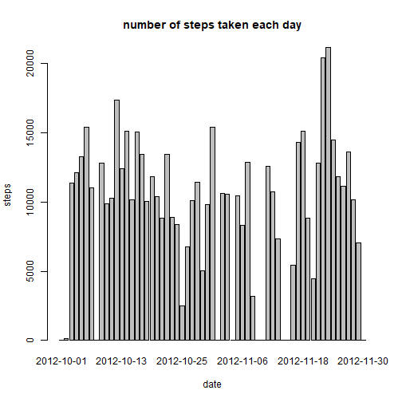
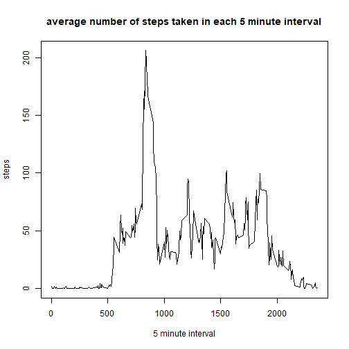
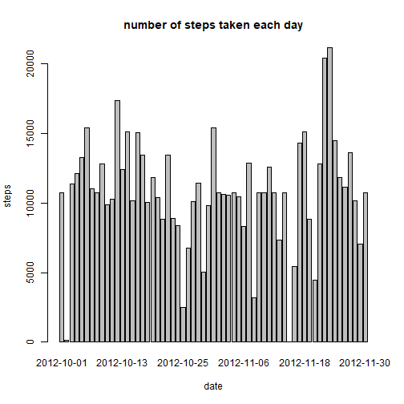
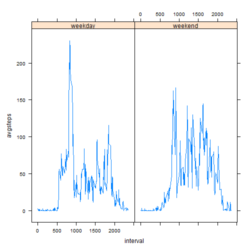

First we load the data and the packages we will use


```r
library(dplyr)
library(stringr)
library(lattice)

data <- read.csv("activity.csv")
```

Steps 2 and 3 are plotting the amount of steps in for each day, as well as calculating the mean and median of that variable


```r
stepsday <- group_by(data, date) %>% summarize(totalsteps=sum(steps, na.rm=T))
barplot(stepsday$totalsteps ~ stepsday$date, xlab="date", ylab="steps", main="number of steps taken each day")
```



```r
mean(stepsday$totalsteps)
```

```
## [1] 9354.23
```

```r
median(stepsday$totalsteps)
```

```
## [1] 10395
```

Afterwards, we calculate the average number of steps for each 5-minute interval and also find which one has the highest average


```r
stepsinterval <- group_by(data, interval) %>% summarise(avgsteps=mean(steps, na.rm=T))
plot(stepsinterval$interval, stepsinterval$avgsteps, type="l", xlab="5 minute interval", 
     ylab="steps", main="average number of steps taken in each 5 minute interval")
```



```r
stepsinterval$interval[which.max(stepsinterval$avgsteps)]
```

```
## [1] 835
```

Next we impute the missing data using means of each 5-minute interval.
For this a table with those means is created, and the ifelse() and match() functions are used to assign the corresponding mean to each of the missing values


```r
dataimpute <- data
meansdf <-  data.frame(interval=unique(dataimpute$interval), intervalmeans=tapply(data$steps, data$interval, function(x) mean(x, na.rm=T)))
dataimpute$steps <- ifelse(is.na(dataimpute$steps), meansdf[match(dataimpute$interval, meansdf$interval), 2], dataimpute$steps)
```

With the imputed data we complete the plot of steps per day


```r
stepsday <- group_by(dataimpute, date) %>% summarize(totalsteps=sum(steps, na.rm=T))

barplot(stepsday$totalsteps ~ stepsday$date, xlab="date", ylab="steps", main="number of steps taken each day")
```



```r
mean(stepsday$totalsteps)
```

```
## [1] 10766.19
```

```r
median(stepsday$totalsteps)
```

```
## [1] 10766.19
```

Finally we sort out which days are weekends and use that information to create the panel plot of number of steps for each 5-minute interval


```r
stepsday$day <- weekdays(as.Date(stepsday$date))
stepsday$weekend <- stepsday$day %in% c("Saturday", "Sunday") %>% factor(levels=c(F, T), labels=c("weekday", "weekend"))
mean(stepsday$totalsteps[!stepsday$day %in% c("Monday", "Tuesday", "Wednesday", "Thursday", "Friday")]) -
  mean(stepsday$totalsteps[stepsday$day %in% c("Monday", "Tuesday", "Wednesday", "Thursday", "Friday")])
```

```
## [1] 1945.676
```

```r
dataimpute$day <- weekdays(as.Date(dataimpute$date))
dataimpute$weekend <- dataimpute$day %in% c("Saturday", "Sunday") %>% factor(levels=c(F, T), labels=c("weekday", "weekend"))

dataimpute5min <- group_by(dataimpute, interval, weekend) %>% summarize(avgsteps =mean(steps))
```

```
## `summarise()` has grouped output by 'interval'. You can override using the `.groups` argument.
```

```r
xyplot(avgsteps~interval|weekend, data=dataimpute5min, type="l")
```


